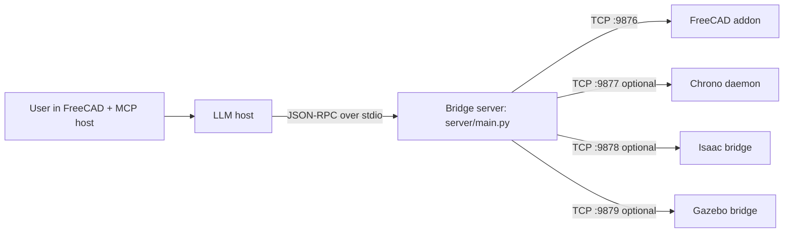

# SolidMind CAD

[](https://github.com/John-Cusack/solidmind-cad/actions/workflows/ci.yml)
[](LICENSE)
[](https://www.python.org/downloads/)
[](https://www.freecad.org/)

> **An LLM that drives FreeCAD until your part passes simulation.** Sketches, pads, fillets, FEA, kinematic + dynamic sim, and a self-verifying orchestrator that re-measures every worker output. See it work in [`examples/`](examples/) or scroll for the autonomous-iteration thesis.

## 60-second quickstart

```bash
git clone https://github.com/John-Cusack/solidmind-cad
cd solidmind-cad
pip install -e .                                            # core install (Python ≥ 3.12)
maturin develop --manifest-path geometry/Cargo.toml         # Rust geometry kernel (one-time)
scripts/install_freecad_addon.sh                            # registers the FreeCAD addon
# Then open FreeCAD, start a Claude Code session in this dir, and ask:
#   "Make me a 30 × 20 × 10 mm bracket with an M5 hole through the long axis."
```

Optional installs: `pip install -e .[orchestrator]` adds the multi-worker outer-loop dependencies; `pip install -e .[dev]` adds ruff + test extras. See [`CONTRIBUTING.md`](CONTRIBUTING.md) for the full dev setup.

## See it work

Two flagship demos that exercise the full outer-loop stack end-to-end:

**[`examples/planetary_gearbox/`](examples/planetary_gearbox/)** — 6 worker builds in a single orchestrator run produce a complete 5:1 planetary gearbox (sun + 3 planets + carrier + ring gear), each independently re-measured by the validator. ~30 s. The visual proof of the outer-loop thesis: spec → 6 STEPs → 6 dimension checks all pass against frozen ICDs.

```bash
PYTHONPATH=. python3 examples/planetary_gearbox/run.py --out /tmp/gearbox
```

**[`examples/hexapod_robot/`](examples/hexapod_robot/)** — full CAD → URDF → Isaac Sim → walking RL policy stack. Builds a 37-body hexapod live in FreeCAD, exports a URDF via `motion.define_mechanism` + `cad.export_sim_package`, trains a PPO walking policy on the freshly-built robot, and watches it walk in Isaac. ~20 min total.

```bash
./examples/hexapod_robot/build_and_train.sh    # build + URDF + train (~20 min)
./examples/hexapod_robot/watch_walking.sh      # Isaac GUI walking demo
```

See [`examples/hexapod_robot/ISAAC_DEMO.md`](examples/hexapod_robot/ISAAC_DEMO.md) for the full walkthrough with measured trajectory data.

---

Digital advances outpace physical-world changes because atoms are harder to move than bits. CAD is the bridge — it turns digital intent into physical reality. Speed up CAD and you speed up progress in the real world.

**The bet behind SolidMind CAD is this: with enough simulation in the loop, an LLM can iterate on its own mechanical designs — build a part, watch it break in physics, fix it, and repeat — until the thing actually works.** This repo is the early version of that. Today the LLM is a powerful co-pilot; the goal is an autonomous engineering loop with humans only on the critical gates.

The foundation is FreeCAD — every sketch, pad, pocket, fillet, and assembly lives inside its parametric CAD engine. From there the LLM drives analytical checks, kinematic simulation in FreeCAD's Assembly workbench, and full dynamic simulation in Isaac Sim, Gazebo, or Chrono. Screenshots come back after every feature so the LLM can see what it built. When simulation finds a problem, the LLM already has every tool it needs to fix the geometry and try again — all in the same conversation.

## What it does today

> "Design an 18-DOF hexapod robot"

From that single prompt the LLM drives the full pipeline. An ideal run of the loop looks like this:

1. **Design** — registers the kinematic structure through the `design.*` brief pipeline (6 legs × 3 DOF), sizes the servos, picks arbor paths clear of collisions. Interfaces are explicit before any geometry exists.
2. **Build v1** — creates each leg segment as a composite body in FreeCAD's PartDesign workbench, pockets in the servo mounts. A verification screenshot comes back after every feature so the LLM catches drift before the next step.
3. **Assemble** — attaches joints via the FreeCAD 1.1 Assembly workbench, runs `motion.check_interference` over the full range of motion.
4. **First sim** — `cad.export_sim_package` generates URDF + meshes, `motion.simulate` drops the robot into Isaac Sim. Suppose the femur buckles under body weight on the first step.
5. **Fix and re-sim** — the LLM reads the joint-load results, widens the femur cross-section, re-exports, re-imports, re-sims. Stands.
6. **Stress check** — `analysis.stress_from_simulation` pipes peak walking torques into CalculiX on the hip bracket. Factor of safety comes back at 1.3 — marginal. LLM adds a fillet at the high-stress corner, re-checks, FoS = 2.4.
7. **Teleop / train** — *only now* does the robot go to `motion.teleop_command` for manual driving, or to `rl.start_training` to learn a walking policy from scratch.

The loop — build, sim, see what broke, fix, re-check — is the point. No manual feature trees, no URDF hand-editing, no context switching between tools.

> **Reality check:** the geometry, sim, analysis, and study tools above all exist and work. Getting the LLM to execute the *diagnosis* steps (reading a sim failure and picking the right fix) reliably without human nudging is the active research problem — see [Where it's going](#where-its-going) for an honest breakdown of what's autonomous today vs. what still needs a human in the loop.
>
> Screenshots and a video walkthrough will land in `docs/images/` and on a GitHub release — `.gitignore` already has the exception so illustrations can be committed under `docs/images/`.

## Where it's going

The long-term goal is an LLM that can take a mechanical design goal, iterate on it in simulation until every constraint is met, and hand you a buildable part with the reasoning trail intact. "You approved the loop" instead of "you approved every step."

**Two loops, not one.** The project actually has two design loops operating at different scales, and both are needed:

- **The outer loop** — `orchestrator/*` drives a G0 → G7 gate walk with parallel workers, SBCE candidate ranking, and release packaging. ~170 tests across 11 orchestrator-focused test files. *Status:* ✓ closed on 5 part classes — `orchestrator/worker_builds/` produces real STEP geometry for `sun_gear`, `planet_carrier`, `quadrotor_arm`, `rc_car_chassis`, and `hexapod_leg`; `orchestrator/measure.py` re-imports each STEP independently and validates against frozen ICDs; `tests/test_orchestrator_drift_e2e.py` proves the validator catches deliberate measurement lies via `FailureCode.MEASUREMENT_DRIFT`.
- **The inner loop** — what the table below describes — is the nine-step iteration cycle that runs *inside* a single worker when it's trying to make one subsystem pass its constraints. *Status:* mostly missing; that's the bulk of the roadmap.

These loops are complementary, not competing. SBCE picks the winner across whole design variants; the inner loop keeps each individual variant from dying to preventable failures. See [`docs/ROADMAP.md §"Two loops, not one"`](docs/ROADMAP.md) for the full breakdown of which parts of each loop are real today.

**The inner loop.** The cycle an engineer runs inside Embodiment and Detail Design has nine steps. Six of them have direct equivalents in the canonical ME textbooks (Shigley, Pahl & Beitz, Ullman, Dieter). Three of them — **Reflect**, **Screen**, and **Learn** — are senior-engineer folklore the textbooks assume rather than teach. See [`docs/ROADMAP.md`](docs/ROADMAP.md) for the full pedigree, textbook citations, and per-step status.

| # | Step | Status | Notes |
|---|---|---|---|
| 1 | **Specify** — task clarification, brief, interfaces | ✓ | `design.*` brief pipeline + `spec.*` interview flow cover this well |
| 2 | **Synthesize** — create/modify geometry | ✓ | `cad.*` drives FreeCAD PartDesign directly; 23 parametric generators in `geometry.*` |
| 3 | **Reflect** — pre-check thinking: what failure modes am I worried about, what do I expect, do I even need to simulate? | ✗ | Folklore step. Exists only as prompt rules in `.claude/rules/`. No structured tool forces the LLM to file its expectations before running the solver. |
| 4 | **Screen** — cheap analytical first-pass (hand calc, SCF lookup, buckling bound) | ◐ | `motion.*` has a real tier ladder (Tier 1 analytical → Tier 2 kinematic → Tier 3 dynamic). `analysis.*` doesn't — `stress_check`/`thermal_check`/`aero_check` go straight to FEA/CFD. The fix is to copy motion's tier pattern into analysis, not to invent a new tool group. |
| 5 | **Simulate** — press the solver button (stress, thermal, aero, dynamic) | ✓ | `analysis.*` + `motion.simulate` with Isaac/Gazebo/Chrono backends; `analysis.stress_from_simulation` couples Tier 3 forces into FEA. |
| 6 | **Interpret** — compare result against Reflect expectations, classify the failure mode | ◐ | `AnalysisCheck` has the right shape (`status`, `measured`, `limit`, `face_group`, `suggestion`) but `name` is a free-form string. No `FailureMode` enum. No comparison-to-expectations tool. |
| 7 | **Decide** — pick a fix that addresses the mechanism, not the symptom | ◐ macro / ✗ micro | *Macro scale:* `orchestrator/sbce.py` + `scorer.py` + `validator.py` rank whole design variants via Set-Based Concurrent Engineering (◐, well-tested). *Micro scale:* nothing turns a single failing `AnalysisCheck` into a ranked list of repair candidates (✗). |
| 8 | **Act** — apply the fix and re-check | ◐ | Re-uses `cad.*` tools. No dedicated fix log, no loop-aware dispatch that automatically re-runs the check that found the failure. |
| 9 | **Learn** — record the finding so the next session doesn't repeat the mistake | ◐ | Folklore step. `knowledge.*` infrastructure exists but the corpus is empty and no test verifies ingest → fresh session → search → recall. |

Observation tools (`cad.screenshot`, `cad.get_body_topology`, `face_map`, etc.) are cross-cutting — they support every step and aren't a step of their own.

**The hard problem.** The expensive substrate — FreeCAD automation, three sim backends, FEA coupling, RL training — is built and working. What's missing is making the LLM *reliably* execute the Reflect and Interpret steps: stop and think before running the solver, and compare what came back against what it expected. Today those happen implicitly (or not at all) in model context. The roadmap proposal is to force them into structured tools and data so they're unskippable.

**Why the current gates are human.** A bad mechanical part costs money or gets someone hurt. Until the loop is demonstrably reliable on a given part class, the design pipeline keeps humans on the approval gates by default (see [`.claude/rules/design-pipeline.md`](.claude/rules/design-pipeline.md) for the phased flow). The rules that say "Never auto-run. Always suggest." exist because we'd rather be annoying than ship a broken robot arm. As the autonomous loop gets more trustworthy on each class of part, those gates will relax.

**How to push it closer — the priority stack.** Three parallel moves, each independently high-leverage. See [`docs/ROADMAP.md §"Priority stack"`](docs/ROADMAP.md) for the full rationale.

1. **Bring `analysis.*` up to `motion.*`'s tier structure.** Add `analysis.screen_stress` / `analysis.screen_thermal` / `analysis.screen_aero` as analytical first-pass tools (beam theory, SCF tables, buckling bounds, lumped capacitance, BEMT). Gate Tier 3 FEA/CFD behind them so most routine parts never touch the solver. Copies an in-repo pattern (motion's tier ladder) that's already proven to work — and it's the single change that turns the Screen step from ◐ into ✓ while also unblocking the Reflect step's "do I need to simulate?" decision.
2. **Paired wedge: `FailureMode` enum + `ReflectExpectations` dataclass.** Add a typed `FailureMode` enum to `AnalysisCheck` in `server/analysis_models.py:191` so downstream tooling can dispatch on a typed value, and add a `ReflectExpectations` dataclass the LLM fills in before calling `analysis.*`. Neither alone is sufficient; together they unblock Interpret, Decide, Act, and the loop-closure test.
3. ~~**Wire one real worker build into `test_orchestrator_e2e.py`.**~~ ✓ done — the outer loop is now closed against five real part classes. The `orchestrator/worker_builds/` package and `tests/test_orchestrator_real_worker_e2e.py` cover `sun_gear`, `planet_carrier`, `quadrotor_arm`, `rc_car_chassis`, `hexapod_leg`. `tests/test_orchestrator_drift_e2e.py` covers deliberate-drift detection.

Then, after those land:

- **Unskip `tests/test_iteration_loop_e2e.py`** against a known part class — the forcing function for the whole inner loop.
- **Knowledge persistence test** that proves `knowledge.ingest` → fresh session → `knowledge.search` actually recalls what was stored.
- **Part-class failure-mode taxonomies** (YAML per class) so Reflect has a real lookup table for hexapod / gearbox / quadrotor / rc-car.
- **Curated `me_knowledge/notes/` corpus** so Learn stops being dead weight.

**The punch list.** [`docs/ROADMAP.md`](docs/ROADMAP.md) is the canonical per-step gap analysis — it walks each of the nine loop steps (Specify → Synthesize → Reflect → Screen → Simulate → Interpret → Decide → Act → Learn), cites the textbook pedigree of each step, maps every tool and every test file to its step, and gives concrete next steps for moving each ◐ / ✗ to ✓. It also defines the three-test bar for claiming the loop is closed on a given part class. Start there if you want to contribute.

See [CONTRIBUTING.md](CONTRIBUTING.md) and [`docs/simulation-and-rl.md`](docs/simulation-and-rl.md) for the entry points.

## Getting Started

> **Platform:** Linux only (tested on Ubuntu/Debian). macOS and Windows are not currently supported.
>
> **MCP host:** Tested with [Claude Code](https://docs.anthropic.com/en/docs/claude-code). Other stdio-based MCP hosts may work but are not tested.

### 1. Install prerequisites

```bash
# Rust toolchain (needed for geometry extension)
curl --proto '=https' --tlsv1.2 -sSf https://sh.rustup.rs | sh
source "$HOME/.cargo/env"
```

### 2. Install FreeCAD

Download the AppImage and symlink it onto your PATH. **FreeCAD 1.1 is
recommended; 1.0.2 is still supported via the compatibility layer.**

```bash
mkdir -p ~/Applications
wget -O ~/Applications/FreeCAD_1.1.0-Linux-x86_64-py311.AppImage \
  "https://github.com/FreeCAD/FreeCAD/releases/download/1.1.0/FreeCAD_1.1.0-Linux-x86_64-py311.AppImage"
chmod +x ~/Applications/FreeCAD_1.1.0-Linux-x86_64-py311.AppImage
sudo ln -s ~/Applications/FreeCAD_1.1.0-Linux-x86_64-py311.AppImage /usr/local/bin/freecad
```

> **Note:** Use a symlink to the AppImage — do not copy/move the binary directly.
> Snap and flatpak installs are not supported (sandboxing breaks addon auto-start).

### 3. Install SolidMind CAD

```bash
sudo apt-get install -y python3-pip python3-venv   # Ubuntu/Debian
python3 -m venv .venv
source .venv/bin/activate
pip install -e .                                   # core install (pulls maturin + builds the Rust extension)
maturin develop --manifest-path geometry/Cargo.toml  # rebuilds the Rust extension in-place after edits
```

Optional extras:

```bash
pip install -e ".[knowledge]"      # LanceDB + Docling + embeddings for the knowledge store
pip install -e ".[orchestrator]"   # httpx for the docker/A2A orchestrator path
pip install -e ".[fea]"            # gmsh + meshio for mesh generation in analysis tools
```

### 4. Run tests

```bash
python3 -m unittest
```

### 5. Install the FreeCAD addon

```bash
scripts/install_freecad_addon.sh
```

### 6. Configure MCP

Copy the example MCP config:

```bash
cp .mcp.json.example .mcp.json
```

This tells your MCP host (Claude Code) how to launch the bridge server. The default config uses the venv Python:

```json
{
  "mcpServers": {
    "solidmind-cad": {
      "command": ".venv/bin/python3",
      "args": ["-m", "server.main"],
      "cwd": "."
    }
  }
}
```

### 7. Launch FreeCAD

Start FreeCAD before using any `cad.*` tools — the bridge server connects to the addon over TCP.

```bash
freecad &
```

You should see `[SolidMind] Addon started successfully` in the FreeCAD Python console.

### 8. Verify it works

Start Claude Code in the repo directory. The MCP server starts automatically. Try:

```
> Make a 20mm cube with 2mm fillets on all edges
```

You should see the cube appear in FreeCAD with verification screenshots returned at each step.

## How It Works

### Describe → Build → Validate

The pipeline has three stages, each driven by conversation:

**1. Describe** — You tell the LLM what you want. For simple parts it goes straight to building. For complex assemblies (robots, drones, mechanisms), it runs a design brief pipeline: intent → sizing → layout → user approval at each gate.

**2. Build** — The LLM drives FreeCAD's PartDesign workbench directly: `cad.sketch` → `cad.pad` → `cad.pocket` → `cad.fillet` → etc. Every operation returns verification screenshots so the LLM catches errors before moving on. User clicks in FreeCAD feed back through `cad.get_selection`.

**3. Validate** — Once geometry exists, validate that it actually works:

| Tier | What it checks | How | Tools |
|------|---------------|-----|-------|
| **Analytical** | Gear ratios, torque/speed propagation, DOF count, Grashof criteria, power conservation | Pure math, no simulation needed | `motion.validate`, `motion.propagate_motion`, `motion.check_gear_train` |
| **Kinematic** | Joint connectivity, range-of-motion interference, swept-volume collisions | FreeCAD Assembly workbench | `motion.create_assembly`, `motion.drive_joint`, `motion.check_interference` |
| **Dynamic** | Real physics — contact, gravity, friction, motor torques, closed-loop control | GPU/CPU simulation backends | `motion.simulate`, `motion.teleop_*` |

Dynamic simulation supports three backends, chosen by what you're building:

| Backend | Best for | Teleop DOF | Requires |
|---------|----------|-----------|----------|
| **Isaac Sim** | Legged robots, articulated arms, anything needing GPU contact physics | 3 (vx, yaw, height) | NVIDIA GPU, Isaac Sim |
| **Gazebo** | Drones (PX4), wheeled vehicles, CPU-only environments | 5 (vx, vy, vz, yaw, height) | Gazebo Harmonic |
| **Chrono** | Gear trains, linkages, cams — analytical MBS validation | batch only | Chrono daemon |

The full loop for a robot: describe the hexapod → LLM builds leg segments with servo pockets → `cad.export_sim_package` generates URDF + meshes → `motion.simulate` drops it into Isaac Sim → `motion.teleop_start` lets you drive it around → optionally `rl.start_training` trains a walking policy.

### Communication Pipeline

```
MCP host (Claude Code, etc.)
  → JSON-RPC over stdio
    → Bridge server (server/main.py)
      → TCP socket localhost:9876 (newline-delimited JSON)
        → FreeCAD addon (runs inside FreeCAD GUI)
          → FreeCAD Python API
```

Responses flow back the same path, carrying JSON metadata (face maps, topology info) and base64-encoded verification images so the LLM can inspect the model without needing a screen.

### Design Brief Pipeline (Complex Assemblies)

For multi-body assemblies, robots, or designs that need research before building:

1. **Intent** — clarify what's being built and why (conversation, no tools)
2. **Sizing** — engineering calculations, component selection, weight budgets (`design.save_brief`, `design.add_part`)
3. **Layout** — spatial relationships, interface definitions, joint placement (`design.add_interface`, `design.update_brief`)
4. **Build** — construct each part in FreeCAD, referencing the approved brief (`cad.*`)
5. **Verify** — `design.verify_build` confirms all planned parts exist

Each phase has a user gate — the LLM presents its work, you confirm before it moves on.

### Orchestrator (Complex Assemblies)

For assemblies with 3+ subsystems, mechanisms, or multi-worker builds, the orchestrator automates the design brief pipeline with parallel workers, deterministic gates, and SBCE (Set-Based Concurrent Engineering) ranking.

The orchestrator runs a 7-stage pipeline:

| Stage | What | Gate |
|-------|------|------|
| 0. Requirements | Normalize goals into objectives with units + thresholds | G0 — objectives complete |
| 1. Council | Decompose into subsystems, feasibility check | G1 — budgets coherent (human approval) |
| 2. Skeleton | Freeze datums, axes, reserved volumes | G2 — skeleton complete (human approval) |
| 3. ICD Freeze | Lock interfaces + purchased parts | G3 — ICDs complete (human approval) |
| 4. Worker Dispatch | Parallel workers build generated parts | G4 — all artifacts present |
| 5. Validation | Geometry + assembly checks against frozen contracts | G5 — dimensionally compliant (human approval) |
| 6. Scoring | SBCE ranking, Pareto frontier | G6 — at least one candidate meets thresholds |
| 7. Release | BOM, ICDs, provenance, decision report | G7 — release package complete (human approval) |

In interactive sessions, Claude Code **is** the orchestrator — it calls `orchestrator.runner` for deterministic logic and dispatches workers as parallel Agent subagents. For headless/CI use: `python -m orchestrator`.

See [`docs/orchestrator-plan-cad-rewrite.md`](docs/orchestrator-plan-cad-rewrite.md) for the full pipeline spec and [`orchestrator/README.md`](orchestrator/README.md) for the module guide.

## Architecture



Core modeling is the two-process bridge (`server/main.py` ↔ `freecad_addon`). Simulation backends are optional TCP sidecars — only needed when you want dynamic validation.

## Tool Groups

The MCP server exposes **121 tools** across 11 groups:

| Group | Purpose |
|-------|---------|
| `cad.*` (47) | Drive FreeCAD PartDesign — sketches, solids, fillets, export, spatial audit |
| `design.*` (10) | Structured design briefs for complex assemblies |
| `motion.*` (18) | Mechanism validation — analytical, kinematic, and dynamic tiers |
| `rl.*` (6) | RL training/deploy for simulation-driven control |
| `study.*` (7) | Parametric design optimization — sweep, solve, rank |
| `geometry.*` (6) | Parametric generators — involute gears, planetary layouts, propeller blades |
| `mfg.*` (3) | Manufacturing readiness checks and RFQ export |
| `me.*` (5) | Deterministic ME preflight — validators, traceability, risk gates |
| `spec.*` (10) | Spec interview/finalization and geometry planning |
| `knowledge.*` (5) | Knowledge extraction, ingestion, and hybrid search |
| `fastener (cad.*)` (4) | Fastener dimension lookup and bolt/nut building |

## Extension Packs

SolidMind CAD has a plugin system that lets you add new tools and engineering knowledge without modifying core code. A pack is a standard pip package with a couple of module attributes — no base classes, no config files.

### Installing a pack

```bash
pip install solidmind-sheetmetal
# Restart the MCP server — new tools appear automatically
```

### Two kinds of packs

**Tool packs** add MCP tools (geometry calculators, analysis functions). The pack module exposes a `TOOLS` list (MCP schemas) and a `DISPATCH` dict (tool name → handler). Core tools always take priority — packs can't override built-ins.

**Knowledge packs** ship curated markdown files (design rules, material tables, worked examples). They auto-ingest into the LanceDB knowledge store on first `knowledge.search`, with version tracking so bumping the version triggers re-ingestion.

A single pack can be both.

### Creating a pack

Minimal pack = 4 files:

```
solidmind-sheetmetal/
├── pyproject.toml              # entry point registration
├── solidmind_sheetmetal/
│   ├── __init__.py
│   ├── pack.py                 # TOOLS + DISPATCH (+ optional KNOWLEDGE_DIR/DOMAIN/VERSION)
│   └── tools.py                # your tool functions
```

Register via standard entry points in `pyproject.toml`:

```toml
[project.entry-points."solidmind.tool_packs"]
sheetmetal = "solidmind_sheetmetal.pack"

[project.entry-points."solidmind.knowledge_packs"]
sheetmetal = "solidmind_sheetmetal.pack"
```

See [`docs/creating-packs.md`](docs/creating-packs.md) for the full developer guide and [`examples/solidmind-example-pack/`](examples/solidmind-example-pack/) for a working example.

## Requirements

- **[FreeCAD 1.1](https://github.com/FreeCAD/FreeCAD/releases/tag/1.1.0)** AppImage (1.0.2 also supported) — the foundation; all CAD modeling, Tier 2 kinematic simulation, and visual verification run inside FreeCAD (0.21 is **not** supported)
- Python `>= 3.12`
- Rust toolchain ([rustup](https://rustup.rs/)) for the `solidmind_geometry` extension

Optional (only needed for specific features):

| Component | Needed for |
|-----------|-----------|
| Isaac Sim + NVIDIA GPU | `motion.simulate backend=isaac`, `rl.*` training |
| Gazebo Harmonic | `motion.simulate backend=gazebo`, drone PX4 SITL |
| Chrono daemon | `motion.simulate backend=chrono`, `study` chrono solver |
| OpenFOAM + FreeCADCmd | OpenFOAM study pipeline |
| LanceDB + Docling + embeddings | Full `knowledge.*` store (degrades to local notes without) |

See [`docs/simulation-and-rl.md`](docs/simulation-and-rl.md) for simulation backend setup, RL training, and validation test commands.

## Documentation

- [`docs/ROADMAP.md`](docs/ROADMAP.md) — **tooling assessment vs the autonomous-iteration thesis; start here if you want to contribute**
- [`docs/simulation-and-rl.md`](docs/simulation-and-rl.md) — simulation backends, RL training, validation tests
- [`docs/creating-packs.md`](docs/creating-packs.md) — creating tool and knowledge extension packs
- [`ARCHITECTURE.md`](ARCHITECTURE.md) — architecture and protocol surface
- [`docs/freecad_to_isaac_pipeline.md`](docs/freecad_to_isaac_pipeline.md) — FreeCAD → Isaac pipeline
- [`docs/gazebo_integration.md`](docs/gazebo_integration.md) — Gazebo backend design
- [`docs/tool-design-cad-create-primitive.md`](docs/tool-design-cad-create-primitive.md) — primitive tool contract
- [`docs/fix-urdf-export-coordinates.md`](docs/fix-urdf-export-coordinates.md) — URDF coordinate fixes
- [`docs/orchestrator-plan-cad-rewrite.md`](docs/orchestrator-plan-cad-rewrite.md) — orchestrator pipeline spec (authoritative)
- [`docs/orchestrator-7-arch-fixes.md`](docs/orchestrator-7-arch-fixes.md) — orchestrator architecture review and fixes

<details>
<summary>Developer reference</summary>

### LLM Interaction Contract

- `spec.apply_answer` uses JSON-pointer addressing with deterministic ops: `set`, `append`, `remove`.
- Bulk geometry is exchanged via **handles** (`geometry_ref`) rather than large arrays in model text.
- `cad.sketch` resolves `geometry_ref` server-side and uses batched `sketch_populate` for one-recompute sketch creation.
- Modeling responses include structured spatial feedback: `face_map`, `operation_summary`, verification images, `selection_drift` signals.

### Policy-Driven Planning (V1)

`spec.plan_geometry` supports `planning_mode=legacy|policy_v1` with process/archetype-aware planning and deterministic checkpoints (`BASE`, `INTERFACES`, `STRUCTURE`, `PATTERNS`, `FINISH`).

</details>

## Future Improvements

1. Playwright-backed research pipeline for supplier pages, datasheets, and spec tables.
2. Flexible Bill of Materials (BOM) generation with vendor/SKU/price/lead-time.
3. Gazebo integration hardening — runtime startup, SDF spawn reliability, teleop consistency.
4. Cross-backend regression smoke tests (Isaac, Gazebo, Chrono).
5. Auto-generated tool counts and signatures from `server/main.py` to prevent doc drift.
