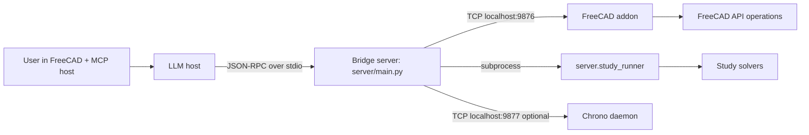

# SolidMind CAD

FreeCAD-integrated MCP CAD co-pilot for turning plain-language ideas into buildable mechanical designs.

## Goal

Make advanced CAD workflows accessible while keeping engineering logic deterministic, inspectable, and testable.

## Runtime Surface (Current)

The MCP server currently exposes **81 tools** across 8 families:

| Family | Count | Module |
|---|---:|---|
| `cad.*` | 33 | `server/tools_cad.py` |
| `mfg.*` | 3 | `server/tools_mfg.py` |
| `spec.*` | 10 | `server/tools.py` |
| `me.*` | 5 | `server/tools_me.py` |
| `knowledge.*` | 5 | `server/tools_knowledge.py` |
| `geometry.*` | 5 | `server/tools_geometry.py` |
| `study.*` | 7 | `server/tools_study.py` |
| `motion.*` | 13 | `server/tools_motion.py` |

## What It Supports

1. Live FreeCAD co-pilot modeling (`cad.*`) including sketches, solids, selection stability, cameras/screenshots, and visibility controls.
2. Manufacturing readiness and RFQ export (`mfg.*`).
3. Deterministic spec interview/finalization and policy-driven geometry planning (`spec.*`).
4. Deterministic ME preflight loop (`me.*`) with validators, traceability, and risk notices.
5. Knowledge extraction/ingestion/search with graceful local fallback (`knowledge.*`).
6. Parametric geometry generators (gears/involutes/planetary layouts) via handle-based transfer (`geometry.*`).
7. Background parametric studies (`study.*`) with coarse/refined sweeps and solver adapters.
8. Motion validation pipeline (`motion.*`) spanning analytical, kinematic, and dynamic tiers.

## Architecture At A Glance



Core modeling remains the two-process bridge (`server/main.py` <-> `freecad_addon`).
`study.run` adds a background runner subprocess, and `motion.simulate` uses an optional Chrono sidecar daemon.

## Simulation Stack

- **Tier 1 (analytical)**: `motion.validate`, `motion.propagate_motion`, `motion.check_gear_train`.
- **Tier 2 (kinematic in FreeCAD Assembly)**: `motion.create_assembly`, `motion.drive_joint`, `motion.check_interference`.
- **Tier 3 (dynamic backend selection)**:
  - `motion.simulate` with `backend=isaac|chrono` (default: `isaac`)
  - Isaac teleop lifecycle: `motion.teleop_start`, `motion.teleop_command`, `motion.teleop_state`, `motion.teleop_stop`

## LLM Interaction Contract

- `spec.apply_answer` uses JSON-pointer addressing with deterministic ops: `set`, `append`, `remove`.
- Bulk geometry is exchanged via **handles** (`geometry_ref`) rather than large arrays in model text.
- `cad.sketch` resolves `geometry_ref` server-side and uses batched `sketch_populate` for one-recompute sketch creation.
- Modeling responses include structured spatial feedback for reasoning and self-check:
  - `face_map`
  - `operation_summary`
  - verification images/views
  - `selection_drift` signals for topology-sensitive selectors

## Policy-Driven Planning (V1)

`spec.plan_geometry` supports `planning_mode=legacy|policy_v1` with process/archetype-aware planning and deterministic checkpoints (`BASE`, `INTERFACES`, `STRUCTURE`, `PATTERNS`, `FINISH`).

## Requirements

- Python `>= 3.12`
- FreeCAD `>= 1.0` (required for live `cad.*` and Tier 2 motion; FreeCAD 0.21 is **not** supported)

Optional/conditional components:

- Chrono daemon binary (required for `motion.simulate` and `study` `chrono` solver runs)
- OpenFOAM + `FreeCADCmd` (required for OpenFOAM study pipeline)
- Rust toolchain + maturin build path for `solidmind_geometry` extension (if missing, `geometry.*` tools return availability errors)
- LanceDB/Docling/embedding runtime for full knowledge store mode (tools degrade to local-note fallback when unavailable)

## Install

```bash
python3 -m pip install -e .
```

## Run

Start MCP server over stdio:

```bash
python3 -m server.main
```

Run unit tests:

```bash
python3 -m unittest
```

Replay a golden transcript:

```bash
python3 scripts/replay_transcript.py tests/transcripts/cnc_L2.yml
```

## Documentation

- `ARCHITECTURE.md`: architecture and protocol surface
- `docs/adr/0001-runtime-module-contracts.md`: runtime source-of-truth contract
- `SPEC_GUIDE.md`: spec interview/finalization guidance
- `schemas/planning_policy.schema.json`: planning policy schema
- `schemas/planning_plan.schema.json`: planning artifact schema
