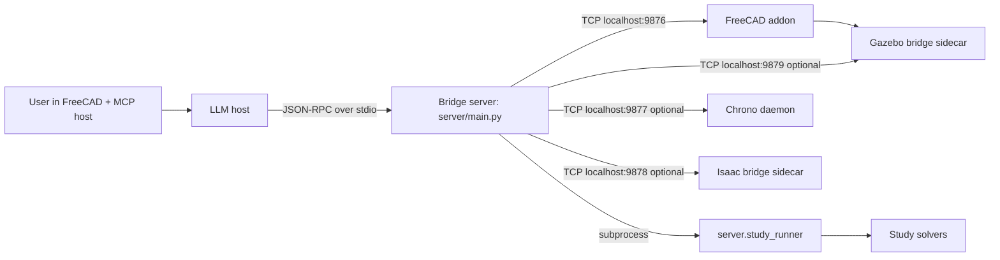

# SolidMind CAD

FreeCAD-integrated MCP CAD co-pilot for turning plain-language ideas into buildable mechanical designs.

## Goal

Make advanced CAD workflows accessible while keeping engineering logic deterministic, inspectable, and testable.

## Runtime Surface (Current)

The MCP server currently exposes **89 tools** across 8 families:

| Family | Count | Module |
|---|---:|---|
| `cad.*` | 36 | `server/tools_cad.py`, `server/tools_fastener.py` |
| `mfg.*` | 3 | `server/tools_mfg.py` |
| `spec.*` | 10 | `server/tools.py` |
| `me.*` | 5 | `server/tools_me.py` |
| `knowledge.*` | 5 | `server/tools_knowledge.py` |
| `geometry.*` | 5 | `server/tools_geometry.py` |
| `study.*` | 7 | `server/tools_study.py` |
| `motion.*` | 13 | `server/tools_motion.py` |
| `design.*` | 7 | `server/tools_design.py` |

## What It Supports

1. Live FreeCAD co-pilot modeling (`cad.*`) including sketches, solids, selection stability, cameras/screenshots, and visibility controls.
2. Manufacturing readiness and RFQ export (`mfg.*`).
3. Deterministic spec interview/finalization and policy-driven geometry planning (`spec.*`).
4. Deterministic ME preflight loop (`me.*`) with validators, traceability, and risk notices.
5. Knowledge extraction/ingestion/search with graceful local fallback (`knowledge.*`).
6. Parametric geometry generators (gears/involutes/planetary layouts) via handle-based transfer (`geometry.*`).
7. Background parametric studies (`study.*`) with coarse/refined sweeps and solver adapters.
8. Motion validation pipeline (`motion.*`) spanning analytical, kinematic, and dynamic tiers.

## Architecture At A Glance



Core modeling remains the two-process bridge (`server/main.py` <-> `freecad_addon`).
`study.run` adds a background runner subprocess, and `motion.simulate` uses an optional Chrono sidecar daemon.

## How It Works

The LLM drives FreeCAD directly — you describe what you want, it decides the tool sequence, builds the geometry, and verifies the result visually at each step. No manual feature trees or constraint dialogs required.

### Communication Pipeline

```
MCP host (Claude Code, etc.)
  → JSON-RPC over stdio
    → Bridge server (server/main.py)
      → TCP socket localhost:9876 (newline-delimited JSON)
        → FreeCAD addon (runs inside FreeCAD GUI)
          → FreeCAD Python API
```

Responses flow back the same path, carrying JSON metadata (face maps, topology info) and base64-encoded verification images so the LLM can inspect the model without needing a screen.

### Simple Parts (Direct Build)

When dimensions are known and the part is straightforward, the LLM builds directly:

1. **`cad.new_document`** — create a FreeCAD document
2. **`cad.new_body`** — create a PartDesign body
3. **`cad.sketch`** — batch-create all sketch geometry and constraints in a single call (one recompute)
4. **`cad.pad`** / **`cad.pocket`** — extrude or cut the sketch profile
5. **`cad.fillet`** / **`cad.chamfer`** — apply finishing features to edges
6. Each step returns verification images (ISO overview + targeted view) for the LLM to self-check

Between steps, `cad.get_body_topology` and `cad.find_edges` discover current face/edge names (topology shifts after every feature), and `cad.get_selection` reads what the user has clicked in FreeCAD.

### Complex Parts (Design Brief Pipeline)

For multi-body assemblies, robots, or designs that need research before building:

1. **Research** — LLM gathers data via `knowledge.search`, web lookups, user-provided specs
2. **`design.save_brief`** — LLM extracts CAD-driving parameters into a structured brief
3. **Review** — brief is presented to the user as a formatted table
4. **`design.update_brief(status="approved")`** — user approves (or modifies)
5. **Build** — LLM constructs the model with `cad.*` tools, referencing the approved brief

The brief is an open dict — the LLM decides what parameters matter for each design. Status flows through `draft → proposed → approved → building → done`.

### Verification and Feedback Loop

Every modeling operation returns verification screenshots (two views: ISO overview and a targeted angle on the new feature). The LLM examines these images to confirm the geometry matches intent — catching misaligned sketches, wrong extrusion directions, or missing features before moving on.

User feedback works through FreeCAD's selection system:

- User clicks a face or edge in FreeCAD
- LLM calls `cad.get_selection` → gets back typed references (e.g., `Face6`, `Edge12`)
- LLM uses those references in follow-up commands: "fillet these edges", "add holes on this face", "sketch on this surface"

### Optional Post-Build Steps

- **`mfg.readiness_check`** — manufacturing validation (wall thickness, draft angles, tolerances)
- **`me.design_loop`** — deterministic ME preflight for high-risk parts (rotors, pressure vessels)
- **`motion.*`** — mechanism validation across analytical, kinematic, and dynamic tiers
- **`study.*`** — parametric optimization (sweep variables, run solvers, rank and build the winner)

## Simulation Stack

- **Tier 1 (analytical)**: `motion.validate`, `motion.propagate_motion`, `motion.check_gear_train`.
- **Tier 2 (kinematic in FreeCAD Assembly)**: `motion.create_assembly`, `motion.drive_joint`, `motion.check_interference`.
- **Tier 3 (dynamic backend selection)**:
  - `motion.simulate` with `backend=isaac|chrono|gazebo` (default: `isaac`)
  - Gazebo batch/teleop requires `urdf_path` or `sdf_path` (SDF recommended for drones)
  - Teleop lifecycle: `motion.teleop_start`, `motion.teleop_command`, `motion.teleop_state`, `motion.teleop_stop`
  - Isaac bridge v1 supports joint types: `revolute`, `prismatic`, `fixed`
  - Unsupported for Isaac bridge v1: `gear_mesh`, `belt_chain`, `cam`, `planar` (returns `UNSUPPORTED_JOINT_TYPE`)

## LLM Interaction Contract

- `spec.apply_answer` uses JSON-pointer addressing with deterministic ops: `set`, `append`, `remove`.
- Bulk geometry is exchanged via **handles** (`geometry_ref`) rather than large arrays in model text.
- `cad.sketch` resolves `geometry_ref` server-side and uses batched `sketch_populate` for one-recompute sketch creation.
- Modeling responses include structured spatial feedback for reasoning and self-check:
  - `face_map`
  - `operation_summary`
  - verification images/views
  - `selection_drift` signals for topology-sensitive selectors

## Policy-Driven Planning (V1)

`spec.plan_geometry` supports `planning_mode=legacy|policy_v1` with process/archetype-aware planning and deterministic checkpoints (`BASE`, `INTERFACES`, `STRUCTURE`, `PATTERNS`, `FINISH`).

## Requirements

- Python `>= 3.12`
- Rust toolchain ([rustup](https://rustup.rs/)) for the `solidmind_geometry` extension
- FreeCAD `>= 1.0` AppImage (required for live `cad.*` and Tier 2 motion; FreeCAD 0.21 is **not** supported)

Optional/conditional components:

- Chrono daemon binary (required for `motion.simulate` and `study` `chrono` solver runs)
- Isaac bridge sidecar (required for Tier 3 `backend=isaac` simulation/teleop)
- Gazebo Harmonic (`gz` CLI) + Gazebo bridge sidecar (required for Tier 3 `backend=gazebo`)
- OpenFOAM + `FreeCADCmd` (required for OpenFOAM study pipeline)
- LanceDB/Docling/embedding runtime for full knowledge store mode (tools degrade to local-note fallback when unavailable)

## Getting Started

### 1. Install FreeCAD

Download the AppImage and symlink it onto your PATH:

```bash
mkdir -p ~/Applications
wget -O ~/Applications/FreeCAD_1.0.2-conda-Linux-x86_64-py311.AppImage \
  "https://github.com/FreeCAD/FreeCAD/releases/download/1.0.2/FreeCAD_1.0.2-conda-Linux-x86_64-py311.AppImage"
chmod +x ~/Applications/FreeCAD_1.0.2-conda-Linux-x86_64-py311.AppImage
sudo ln -s ~/Applications/FreeCAD_1.0.2-conda-Linux-x86_64-py311.AppImage /usr/local/bin/freecad
```

> **Note:** Use a symlink to the AppImage — do not copy/move the binary directly.
> Snap and flatpak installs are not supported (sandboxing breaks addon auto-start).

### 2. Install SolidMind CAD

```bash
sudo apt-get install -y python3-pip python3-venv   # Ubuntu/Debian
python3 -m venv .venv
source .venv/bin/activate
pip install -e .
pip install maturin
maturin develop --manifest-path geometry/Cargo.toml
```

### 3. Run tests

```bash
python3 -m unittest
```

### 4. Install the FreeCAD addon

```bash
scripts/install_freecad_addon.sh
```

Restart FreeCAD — you should see `[SolidMind] Addon started successfully` in the Python console.

### 5. Start the MCP server

```bash
python3 -m server.main
# or
solidmind-cad
```

### Optional: simulation validation (additional)

Optional lightweight simulation validation (no external daemons):

```bash
python3 -m unittest tests.test_tools_motion tests.test_motion_isaac_integration tests.test_simulation_spec_builder tests.test_chrono_client
```

Optional runtime-backed simulation validation:

```bash
SOLIDMIND_RUN_ISAAC_E2E=1 python3 -m unittest tests.test_isaac_bridge_real_runtime
```

Optional Gazebo bridge runtime validation:

```bash
scripts/run_gazebo_bridge.sh --runtime real --world default
SOLIDMIND_RUN_GAZEBO_E2E=1 python3 -m unittest tests.test_gazebo_bridge_real_runtime
```

Optional Gazebo PX4 lifecycle validation (fake PX4 mode for CI/local):

```bash
SOLIDMIND_GAZEBO_PX4_FAKE=1 scripts/run_gazebo_bridge.sh --runtime stub --enable-px4
SOLIDMIND_RUN_GAZEBO_PX4_E2E=1 python3 -m unittest tests.test_gazebo_px4_e2e
```

Optional Chrono backend runtime validation:

```bash
chrono_daemon/run.sh
```

Then in your MCP client/host, run a short manual path:

1. Call `motion.define_mechanism` with a small mechanism payload.
2. Call `motion.simulate` with `backend="chrono"` and the returned `mechanism_id`.

Optional Isaac bridge sidecar (manual runtime path for `backend=isaac`):

```bash
scripts/run_isaac_bridge.sh --host 127.0.0.1 --port 9878
```

Optional Isaac bridge env overrides:

- `SOLIDMIND_ISAAC_HOST`
- `SOLIDMIND_ISAAC_PORT`
- `SOLIDMIND_ISAAC_CONNECT_TIMEOUT_S`
- `SOLIDMIND_ISAAC_READ_TIMEOUT_S`

Optional Gazebo bridge sidecar (manual runtime path for `backend=gazebo`):

```bash
scripts/run_gazebo_bridge.sh --runtime real --world default --host 127.0.0.1 --port 9879
```

Optional Gazebo bridge env overrides:

- `SOLIDMIND_GAZEBO_RUNTIME` (`real` or `stub`)
- `SOLIDMIND_GAZEBO_HOST`
- `SOLIDMIND_GAZEBO_PORT`
- `SOLIDMIND_GAZEBO_CONNECT_TIMEOUT_S`
- `SOLIDMIND_GAZEBO_READ_TIMEOUT_S`

Optional transcript replay:

```bash
python3 scripts/replay_transcript.py tests/transcripts/cnc_L2.yml
```

## Documentation

- `ARCHITECTURE.md`: architecture and protocol surface
- `docs/isaac_bridge_protocol.md`: Isaac bridge TCP command protocol
- `docs/adr/0001-runtime-module-contracts.md`: runtime source-of-truth contract
- `SPEC_GUIDE.md`: spec interview/finalization guidance
- `schemas/planning_policy.schema.json`: planning policy schema
- `schemas/planning_plan.schema.json`: planning artifact schema
