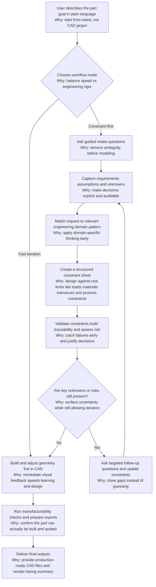

# SolidMind CAD

FreeCAD-integrated MCP CAD co-pilot for turning plain-language ideas into real, buildable designs.

## Goal

Make it possible for any person, not only CAD experts, to use CAD software to design real things.

## Design Philosophy

1. Start from intent, not jargon.
The system asks structured questions in plain language and translates answers into engineering-ready fields.

2. Make the LLM mechanically grounded.
It uses deterministic constraint validation, ME knowledge resources, and a source policy (`me_knowledge/standards_sources.yml`) to tie decisions to engineering context.

3. Convert ideas into explicit constraints.
Before geometry, the system builds a concrete list of requirements: function, materials, dimensions, interfaces, tolerances, manufacturing constraints, and risks.

4. Validate before building.
The ME loop runs deterministic checks, creates traceability, and emits risk notices so unresolved issues are visible without hard blocking generation.

5. Build to the constraints.
For constrained workflows, the CAD flow executes `cad.*` operations after ME preflight; for fast iteration, live `cad.*` co-pilot operation is also available directly.

## Design Process Flow



## Architecture At A Glance


## What It Supports

1. Live CAD co-pilot in FreeCAD (`cad.*` tools) — pad, pocket, revolution, sweep, loft, helix, polar pattern, fillet, chamfer, hole, screenshot, and more.
2. Manufacturing readiness and RFQ export (`mfg.*` tools).
3. ME preflight design loop (`me.*` tools) with constraint validation, traceability, and risk gates.
4. LLM-managed spec interview and finalization (`spec.*` tools).

Current policy:
- Coverage and ME risk outputs are notify-only by default.
- Geometry generation continues while warnings/required actions are returned for review.

## Policy-Driven Planning (V1)

The geometry pipeline now supports an opt-in policy layer between spec input and GIR/EIR generation.

- Default mode: `legacy` (existing behavior).
- New mode: `policy_v1` (process/archetype-aware planning).
- V1 process scope: CNC + FDM.
- V1 policy keys:
  - `cnc_prismatic`
  - `cnc_revolved`
  - `fdm_prismatic`
  - `fdm_thin_wall`

In `policy_v1`, planning includes deterministic phase/checkpoint planning:
- `BASE`
- `INTERFACES`
- `STRUCTURE`
- `PATTERNS`
- `FINISH`

Planning-question budget notes:
- Default budget is loaded from `feature_support/planning_policy.yml`.
- The "max 2 questions" rule applies only to planning runs (not the full interview flow).

## Spec Geometry Planning API Notes

`spec.plan_geometry` now accepts optional `options`:

```json
{
  "planning_mode": "legacy | policy_v1",
  "strict_mode": false,
  "question_budget_override": 2
}
```

When `planning_mode=policy_v1`, additional output fields are returned:
- `planning_plan`
- `planning_plan_hash`
- `policy_key`
- `archetype`
- `assumptions`
- `question_budget`

`spec.generate_cad` metadata now includes:
- `planning_plan_hash`
- `policy_key`
- `checkpoint_summary`
- `repair_recommendations_present`

## Requirements

- Python `>= 3.12`
- FreeCAD (optional, required for live `cad.*` operations)

## Install

```bash
python3 -m pip install -e .
```

## Run

Start MCP server over stdio:

```bash
python3 -m server.main
```

Run unit tests:

```bash
python3 -m unittest
```

Replay a golden transcript:

```bash
python3 scripts/replay_transcript.py tests/transcripts/cnc_L2.yml
```

## ME Design Loop Quick Flow

Typical sequence:

1. `me.validate_constraints` — run deterministic validators over a constraint dict
2. `me.build_traceability` — build requirement-to-evidence traceability matrix
3. `me.apply_risk_gates` — assign risk class and signoff gates

Or run all at once with `me.design_loop`.

Use `me.list_validators` to discover available validators and what fields they read.

## Documentation

- `ARCHITECTURE.md`: system architecture and protocol surface
- `docs/adr/0001-runtime-module-contracts.md`: runtime module/source-of-truth contract
- `SPEC_GUIDE.md`: spec structure and interview/finalization guidance
- `schemas/planning_policy.schema.json`: planning policy contract
- `schemas/planning_plan.schema.json`: planning artifact contract
