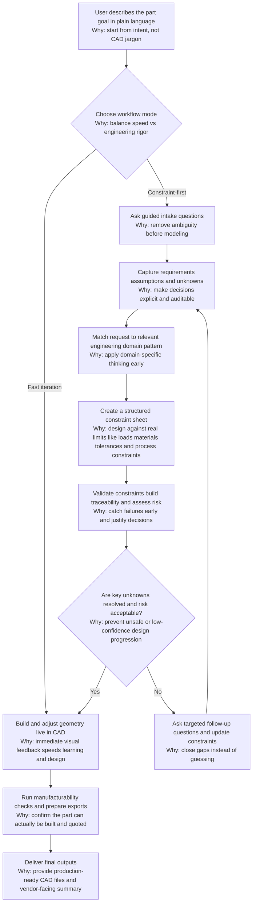

# SolidMind CAD

FreeCAD-integrated MCP CAD co-pilot for turning plain-language ideas into real, buildable designs.

## Goal

Make it possible for any person, not only CAD experts, to use CAD software to design real things.

## Design Philosophy

1. Start from intent, not jargon.
The system asks structured questions in plain language and translates answers into engineering-ready fields.

2. Make the LLM mechanically grounded.
It uses deterministic spec flow, ME archetypes, constraint templates, and a source policy (`me_knowledge/standards_sources.yml`) to tie decisions to engineering context.

3. Convert ideas into explicit constraints.
Before geometry, the system builds a concrete list of requirements: function, materials, dimensions, interfaces, tolerances, manufacturing constraints, and risks.

4. Validate before building.
The ME loop runs deterministic checks, creates traceability, and applies risk gates so unresolved blockers are visible.

5. Build to the constraints.
For constrained workflows, the CAD flow executes `cad.*` operations after spec and ME preflight; for fast iteration, live `cad.*` co-pilot operation is also available directly.

## Design Process Flow



## Architecture At A Glance


## What It Supports

1. Live CAD co-pilot in FreeCAD (`cad.*` tools).
2. Manufacturing readiness and RFQ export (`mfg.*` tools).
3. LLM-managed spec interview and finalization (`spec.*` tools).
4. ME preflight design loop (`me.*` tools) with routing, constraints, validation, traceability, and risk gates.

## Requirements

- Python `>= 3.12`
- FreeCAD (optional, required for live `cad.*` operations)

## Install

```bash
python3 -m pip install -e .
```

## Run

Start MCP server over stdio:

```bash
python3 -m server.main
```

Run unit tests:

```bash
python3 -m unittest
```

Optional: sync ME corpus sources for local research text search:

```bash
python3 scripts/sync_me_corpus.py
```

## ME Design Loop Quick Flow

Typical sequence:

1. `me.route_request`
2. `me.instantiate_constraint_sheet`
3. `me.validate_constraint_sheet`
4. `me.build_traceability`
5. `me.apply_risk_gates`

Or run all at once with `me.design_loop`.

## FreeCAD Optional Script

Generate a minimal CAD stub (envelope box) from a finalized JSON input:

```bash
python3 scripts/freecad_from_spec.py --spec examples/print_3d/L2.json --out /tmp/part.step
```

## Documentation

- `ARCHITECTURE.md`: system architecture and protocol surface
- `ME_IMPLEMENTATION_GUIDE.md`: ME design-loop implementation details
- `SPEC_GUIDE.md`: spec interview model and sufficiency gates
