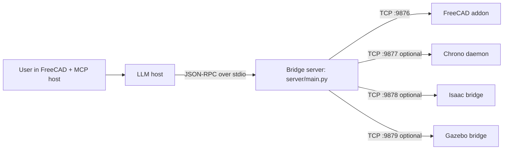

# SolidMind CAD

Digital advances outpace physical-world changes because atoms are harder to move than bits. CAD is the bridge — it turns digital intent into physical reality. Speed up CAD and you speed up progress in the real world.

SolidMind CAD makes this concrete: describe what you want in plain language, and an LLM builds it in FreeCAD — the open-source parametric CAD platform that sits at the center of everything. FreeCAD is the foundation: every sketch, pad, pocket, fillet, and assembly lives there. From that base, you can validate that what you built actually works — analytical checks, kinematic simulation inside FreeCAD itself, and full dynamic simulation in Isaac Sim, Gazebo, or Chrono — all driven from the same conversation.

## Demo

> "Design an 18-DOF hexapod robot"

<!-- TODO: replace with actual screenshots


-->

The LLM designs the kinematic structure, builds each leg segment with servo pockets in FreeCAD, exports a URDF sim package, and runs physics simulation in Isaac Sim — all from a single conversation. No manual feature trees, no URDF hand-editing, no context switching between tools.

## Getting Started

> **Platform:** Linux only (tested on Ubuntu/Debian). macOS and Windows are not currently supported.
>
> **MCP host:** Tested with [Claude Code](https://docs.anthropic.com/en/docs/claude-code). Other stdio-based MCP hosts may work but are not tested.

### 1. Install prerequisites

```bash
# Rust toolchain (needed for geometry extension)
curl --proto '=https' --tlsv1.2 -sSf https://sh.rustup.rs | sh
source "$HOME/.cargo/env"
```

### 2. Install FreeCAD

Download the AppImage and symlink it onto your PATH:

```bash
mkdir -p ~/Applications
wget -O ~/Applications/FreeCAD_1.0.2-conda-Linux-x86_64-py311.AppImage \
  "https://github.com/FreeCAD/FreeCAD/releases/download/1.0.2/FreeCAD_1.0.2-conda-Linux-x86_64-py311.AppImage"
chmod +x ~/Applications/FreeCAD_1.0.2-conda-Linux-x86_64-py311.AppImage
sudo ln -s ~/Applications/FreeCAD_1.0.2-conda-Linux-x86_64-py311.AppImage /usr/local/bin/freecad
```

> **Note:** Use a symlink to the AppImage — do not copy/move the binary directly.
> Snap and flatpak installs are not supported (sandboxing breaks addon auto-start).

### 3. Install SolidMind CAD

```bash
sudo apt-get install -y python3-pip python3-venv   # Ubuntu/Debian
python3 -m venv .venv
source .venv/bin/activate
pip install -e .
# Optional: full knowledge backend (LanceDB + Docling + embeddings)
pip install -e ".[knowledge]"
pip install maturin
maturin develop --manifest-path geometry/Cargo.toml
```

### 4. Run tests

```bash
python3 -m unittest
```

### 5. Install the FreeCAD addon

```bash
scripts/install_freecad_addon.sh
```

### 6. Configure MCP

Copy the example MCP config:

```bash
cp .mcp.json.example .mcp.json
```

This tells your MCP host (Claude Code) how to launch the bridge server. The default config uses the venv Python:

```json
{
  "mcpServers": {
    "solidmind-cad": {
      "command": ".venv/bin/python3",
      "args": ["-m", "server.main"],
      "cwd": "."
    }
  }
}
```

### 7. Launch FreeCAD

Start FreeCAD before using any `cad.*` tools — the bridge server connects to the addon over TCP.

```bash
freecad &
```

You should see `[SolidMind] Addon started successfully` in the FreeCAD Python console.

### 8. Verify it works

Start Claude Code in the repo directory. The MCP server starts automatically. Try:

```
> Make a 20mm cube with 2mm fillets on all edges
```

You should see the cube appear in FreeCAD with verification screenshots returned at each step.

## How It Works

### Describe → Build → Validate

The pipeline has three stages, each driven by conversation:

**1. Describe** — You tell the LLM what you want. For simple parts it goes straight to building. For complex assemblies (robots, drones, mechanisms), it runs a design brief pipeline: intent → sizing → layout → user approval at each gate.

**2. Build** — The LLM drives FreeCAD's PartDesign workbench directly: `cad.sketch` → `cad.pad` → `cad.pocket` → `cad.fillet` → etc. Every operation returns verification screenshots so the LLM catches errors before moving on. User clicks in FreeCAD feed back through `cad.get_selection`.

**3. Validate** — Once geometry exists, validate that it actually works:

| Tier | What it checks | How | Tools |
|------|---------------|-----|-------|
| **Analytical** | Gear ratios, torque/speed propagation, DOF count, Grashof criteria, power conservation | Pure math, no simulation needed | `motion.validate`, `motion.propagate_motion`, `motion.check_gear_train` |
| **Kinematic** | Joint connectivity, range-of-motion interference, swept-volume collisions | FreeCAD Assembly workbench | `motion.create_assembly`, `motion.drive_joint`, `motion.check_interference` |
| **Dynamic** | Real physics — contact, gravity, friction, motor torques, closed-loop control | GPU/CPU simulation backends | `motion.simulate`, `motion.teleop_*` |

Dynamic simulation supports three backends, chosen by what you're building:

| Backend | Best for | Teleop DOF | Requires |
|---------|----------|-----------|----------|
| **Isaac Sim** | Legged robots, articulated arms, anything needing GPU contact physics | 3 (vx, yaw, height) | NVIDIA GPU, Isaac Sim |
| **Gazebo** | Drones (PX4), wheeled vehicles, CPU-only environments | 5 (vx, vy, vz, yaw, height) | Gazebo Harmonic |
| **Chrono** | Gear trains, linkages, cams — analytical MBS validation | batch only | Chrono daemon |

The full loop for a robot: describe the hexapod → LLM builds leg segments with servo pockets → `cad.export_sim_package` generates URDF + meshes → `motion.simulate` drops it into Isaac Sim → `motion.teleop_start` lets you drive it around → optionally `rl.start_training` trains a walking policy.

### Communication Pipeline

```
MCP host (Claude Code, etc.)
  → JSON-RPC over stdio
    → Bridge server (server/main.py)
      → TCP socket localhost:9876 (newline-delimited JSON)
        → FreeCAD addon (runs inside FreeCAD GUI)
          → FreeCAD Python API
```

Responses flow back the same path, carrying JSON metadata (face maps, topology info) and base64-encoded verification images so the LLM can inspect the model without needing a screen.

### Design Brief Pipeline (Complex Assemblies)

For multi-body assemblies, robots, or designs that need research before building:

1. **Intent** — clarify what's being built and why (conversation, no tools)
2. **Sizing** — engineering calculations, component selection, weight budgets (`design.save_brief`, `design.add_part`)
3. **Layout** — spatial relationships, interface definitions, joint placement (`design.add_interface`, `design.update_brief`)
4. **Build** — construct each part in FreeCAD, referencing the approved brief (`cad.*`)
5. **Verify** — `design.verify_build` confirms all planned parts exist

Each phase has a user gate — the LLM presents its work, you confirm before it moves on.

## Architecture



Core modeling is the two-process bridge (`server/main.py` ↔ `freecad_addon`). Simulation backends are optional TCP sidecars — only needed when you want dynamic validation.

## Tool Groups

The MCP server exposes **121 tools** across 11 groups:

| Group | Purpose |
|-------|---------|
| `cad.*` (47) | Drive FreeCAD PartDesign — sketches, solids, fillets, export, spatial audit |
| `design.*` (10) | Structured design briefs for complex assemblies |
| `motion.*` (18) | Mechanism validation — analytical, kinematic, and dynamic tiers |
| `rl.*` (6) | RL training/deploy for simulation-driven control |
| `study.*` (7) | Parametric design optimization — sweep, solve, rank |
| `geometry.*` (6) | Parametric generators — involute gears, planetary layouts, propeller blades |
| `mfg.*` (3) | Manufacturing readiness checks and RFQ export |
| `me.*` (5) | Deterministic ME preflight — validators, traceability, risk gates |
| `spec.*` (10) | Spec interview/finalization and geometry planning |
| `knowledge.*` (5) | Knowledge extraction, ingestion, and hybrid search |
| `fastener (cad.*)` (4) | Fastener dimension lookup and bolt/nut building |

## Extension Packs

SolidMind CAD has a plugin system that lets you add new tools and engineering knowledge without modifying core code. A pack is a standard pip package with a couple of module attributes — no base classes, no config files.

### Installing a pack

```bash
pip install solidmind-sheetmetal
# Restart the MCP server — new tools appear automatically
```

### Two kinds of packs

**Tool packs** add MCP tools (geometry calculators, analysis functions). The pack module exposes a `TOOLS` list (MCP schemas) and a `DISPATCH` dict (tool name → handler). Core tools always take priority — packs can't override built-ins.

**Knowledge packs** ship curated markdown files (design rules, material tables, worked examples). They auto-ingest into the LanceDB knowledge store on first `knowledge.search`, with version tracking so bumping the version triggers re-ingestion.

A single pack can be both.

### Creating a pack

Minimal pack = 4 files:

```
solidmind-sheetmetal/
├── pyproject.toml              # entry point registration
├── solidmind_sheetmetal/
│   ├── __init__.py
│   ├── pack.py                 # TOOLS + DISPATCH (+ optional KNOWLEDGE_DIR/DOMAIN/VERSION)
│   └── tools.py                # your tool functions
```

Register via standard entry points in `pyproject.toml`:

```toml
[project.entry-points."solidmind.tool_packs"]
sheetmetal = "solidmind_sheetmetal.pack"

[project.entry-points."solidmind.knowledge_packs"]
sheetmetal = "solidmind_sheetmetal.pack"
```

See [`docs/creating-packs.md`](docs/creating-packs.md) for the full developer guide and [`examples/solidmind-example-pack/`](examples/solidmind-example-pack/) for a working example.

## Requirements

- **[FreeCAD 1.0.2](https://github.com/FreeCAD/FreeCAD/releases/tag/1.0.2)** AppImage — the foundation; all CAD modeling, Tier 2 kinematic simulation, and visual verification run inside FreeCAD (0.21 is **not** supported)
- Python `>= 3.12`
- Rust toolchain ([rustup](https://rustup.rs/)) for the `solidmind_geometry` extension

Optional (only needed for specific features):

| Component | Needed for |
|-----------|-----------|
| Isaac Sim + NVIDIA GPU | `motion.simulate backend=isaac`, `rl.*` training |
| Gazebo Harmonic | `motion.simulate backend=gazebo`, drone PX4 SITL |
| Chrono daemon | `motion.simulate backend=chrono`, `study` chrono solver |
| OpenFOAM + FreeCADCmd | OpenFOAM study pipeline |
| LanceDB + Docling + embeddings | Full `knowledge.*` store (degrades to local notes without) |

See [`docs/simulation-and-rl.md`](docs/simulation-and-rl.md) for simulation backend setup, RL training, and validation test commands.

## Documentation

- [`docs/simulation-and-rl.md`](docs/simulation-and-rl.md) — simulation backends, RL training, validation tests
- [`docs/creating-packs.md`](docs/creating-packs.md) — creating tool and knowledge extension packs
- [`ARCHITECTURE.md`](ARCHITECTURE.md) — architecture and protocol surface
- [`docs/freecad_to_isaac_pipeline.md`](docs/freecad_to_isaac_pipeline.md) — FreeCAD → Isaac pipeline
- [`docs/gazebo_integration.md`](docs/gazebo_integration.md) — Gazebo backend design
- [`docs/tool-design-cad-create-primitive.md`](docs/tool-design-cad-create-primitive.md) — primitive tool contract
- [`docs/fix-urdf-export-coordinates.md`](docs/fix-urdf-export-coordinates.md) — URDF coordinate fixes

<details>
<summary>Developer reference</summary>

### LLM Interaction Contract

- `spec.apply_answer` uses JSON-pointer addressing with deterministic ops: `set`, `append`, `remove`.
- Bulk geometry is exchanged via **handles** (`geometry_ref`) rather than large arrays in model text.
- `cad.sketch` resolves `geometry_ref` server-side and uses batched `sketch_populate` for one-recompute sketch creation.
- Modeling responses include structured spatial feedback: `face_map`, `operation_summary`, verification images, `selection_drift` signals.

### Policy-Driven Planning (V1)

`spec.plan_geometry` supports `planning_mode=legacy|policy_v1` with process/archetype-aware planning and deterministic checkpoints (`BASE`, `INTERFACES`, `STRUCTURE`, `PATTERNS`, `FINISH`).

</details>

## Future Improvements

1. Playwright-backed research pipeline for supplier pages, datasheets, and spec tables.
2. Flexible Bill of Materials (BOM) generation with vendor/SKU/price/lead-time.
3. Gazebo integration hardening — runtime startup, SDF spawn reliability, teleop consistency.
4. Cross-backend regression smoke tests (Isaac, Gazebo, Chrono).
5. Auto-generated tool counts and signatures from `server/main.py` to prevent doc drift.
